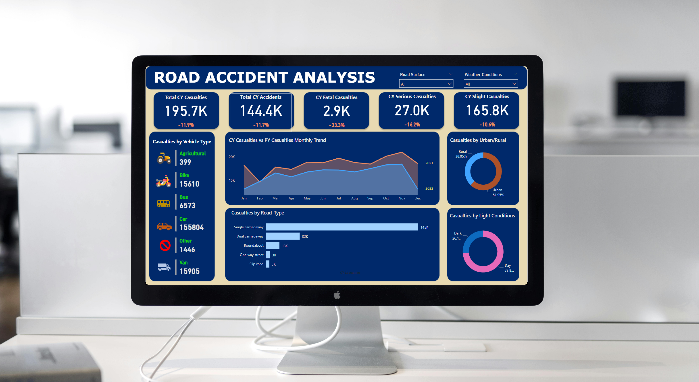

# Road Accident Analysis - Power BI Desktop Project

<p align="center">
    
</p>

## Problem Statement
The aim of this project is to analyze road accident data to understand various factors contributing to casualties and accidents. The analysis will cover different dimensions such as vehicle type, urban vs. rural locations, light conditions, road types, and more. The ultimate goal is to identify trends and patterns that can inform strategies to improve road safety.

## Solution

### Power BI Dashboard
The analysis is performed using Power BI Desktop, providing a dynamic and interactive dashboard that includes:
1. **Summary Cards**: Displaying key metrics such as Total CY Casualties, Total CY Accidents, CY Fatal Casualties, CY Serious Casualties, and CY Slight Casualties.
2. **Vehicle Type Analysis**: Bar chart or similar visualization showing casualties by vehicle type.
3. **Monthly Trend Analysis**: Line chart comparing monthly casualties for the years 2021 and 2022.
4. **Urban vs. Rural Analysis**: Pie chart showing the distribution of casualties in urban and rural areas.
5. **Light Conditions Analysis**: Pie chart displaying the distribution of casualties occurring during the day vs. night.
6. **Road Type Analysis**: Bar chart detailing casualties by different road types.
7. **Filters**: Interactive filters for `weather conditions` and `road surface` types to dynamically update the visualizations.

### Benefits
- **Data-Driven Insights**: Enables stakeholders to understand the key factors contributing to road accidents and casualties.
- **Trend Analysis**: Identifies seasonal and yearly trends in road accidents.
- **Improvement Strategies**: Informs the development of strategies to enhance road safety and reduce casualties.

### Usage
1. **Import Data**: Load the provided road accident data into Power BI Desktop.
2. **Configure Visualizations**: Set up the visualizations as described to reflect the different dimensions of the data.
3. **Apply Filters**: Use the filters for weather conditions and road surfaces to gain specific insights.
4. **Analyze and Report**: Use the dashboard to analyze trends, identify key factors, and generate reports for stakeholders.

By using this dashboard, users can gain a comprehensive understanding of road accidents, allowing for more informed decision-making to improve road safety.

## Repository Information

### Clone and Access Process

To clone and access this project repository, follow these steps:

1. **Clone the Repository**
   ```sh
   git clone https://github.com/Pathakdarshan12/Road_Accident_Analysis_Using_PowerBI.git
   ```

2. **Navigate to the Project Directory**
   ```sh
   cd Road_Accident_Analysis
   ```

3. **Open in Power BI Desktop**
   - Launch Power BI Desktop on your computer.
   - Open the `.pbix` file located in the project directory.

4. **Load Data**
   - Ensure that the dataset is available and correctly linked in Power BI Desktop.
   - If necessary, update the data source settings to point to your data file.

5. **Explore the Dashboard**
   - Use the pre-configured visualizations and filters to explore the data.
   - Customize and update visualizations as needed to suit your analysis requirements.

6. **Contribute**
   - Fork the repository if you plan to contribute to the project.
   - Make your changes and submit a pull request for review.

By following these steps, you can easily access and start working with the road accident analysis project in Power BI Desktop.

---

## Contact

<p align="left">
<a href="https://www.linkedin.com/in/pathakdarshan12/" target="blank">
    
</a>
<a href="https://x.com/_Pathak_Darshan" target="blank">
    
</a>
<a href="https://www.instagram.com/pathakdarshan12/" target="blank">
    
</a>
<a href="mailto:pathakdarshan12@gmail.com" target="blank">
    
</a>
</p>

